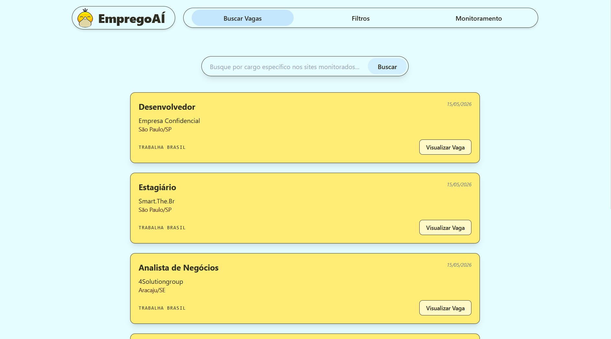

<div align="center">
  
  
  # 🚀 EmpregoAÍ
</div>

Uma plataforma inteligente de busca e automação de vagas de emprego, focada em encontrar as melhores oportunidades de tecnologia em tempo real.

O sistema coleta ativamente vagas de portais de emprego, aplica filtros rigorosos, salva em um banco de dados local e apresenta tudo em uma interface web moderna e rápida, dispensando a necessidade de buscar vagas manualmente todos os dias.

<div align="center">
  <!-- Substitua "screenshot.png" pelo nome exato do arquivo da imagem que você salvou na pasta do projeto -->
  
</div>

## ✨ Funcionalidades Principais

- **Atualizações em Tempo Real (WebSockets):** Sempre que o robô encontrar uma nova vaga, o frontend é atualizado instantaneamente sem necessidade de recarregar a página.
- **Filtro Estrito de Vagas Remotas:** O scraper lê o conteúdo integral (HTML) dos *cards* de vagas para garantir que apenas vagas 100% remotas ou "home office" cheguem ao usuário.
- **Paginação Dinâmica:** Navegação baseada em URL (`?page=X`) utilizando `react-paginate`, permitindo o compartilhamento de links e recarregamentos sem perder a página atual.
- **Notificações Duplas:** Sistema de alertas na própria tela ("Toasts") e integração nativa com o sistema operacional para avisar sobre novas oportunidades mesmo com a aba minimizada.
- **Design Totalmente Responsivo:** Construído de forma "Mobile-First" com TailwindCSS, adaptando-se perfeitamente de celulares a monitores grandes.

## 🏛️ Arquitetura e Padrões

O projeto adota conceitos de **Clean Architecture**, dividindo responsabilidades de forma clara e escalável:
- **`domain/`**: Regras de negócio puras e modelos centrais.
- **`application/`**: Serviços e lógica de orquestração (ex: `JobService`).
- **`infrastructure/`**: Comunicação com o mundo externo (Bancos de dados SQLite, Scrapers Web, Serviços de Notificação).
- **`interfaces/`**: Rotas de API FastAPI e schemas Pydantic.

## 🛠️ Tecnologias Utilizadas

### **Backend (API & Automação)**
- **Python 3.11**
- **FastAPI** (APIs REST e conexões via WebSocket)
- **SQLAlchemy** (ORM para banco de dados SQLite)
- **BeautifulSoup4 & requests** (Web Scraping Robusto e Limpeza com Regex)
- **APScheduler** (Execução de tarefas em background)

### **Frontend (Interface do Usuário)**
- **React 18**
- **Vite** (Build tool de altíssima performance)
- **TailwindCSS** (Estilização utilitária moderna)
- **React Router DOM** (Gerenciamento de rotas e estado via URL)
- **React Paginate** (Lógica avançada de paginação)

### **Infraestrutura (Orquestração)**
- **Docker**
- **Docker Compose**

---

## ⚙️ Como Executar o Projeto

Graças ao Docker, rodar o projeto inteiro (Frontend, Backend e Banco de Dados) agora é um processo de apenas **um passo**.

Certifique-se de ter o **Docker Desktop** rodando na sua máquina.

### 🐳 Via Docker (Recomendado)
Abra um terminal na raiz do projeto e execute:
```bash
docker-compose up --build
```
> **Frontend:** `http://localhost:5173`
> **Backend API:** `http://localhost:8000`

O Docker espelha o código local para dentro do container. Isso significa que você tem **Hot-Reload**: qualquer alteração salva no VS Code atualizará os servidores automaticamente!

### 💻 Execução Manual (Alternativa sem Docker)

<details>
<summary>Clique para ver as instruções manuais</summary>

**Backend:**
```bash
cd backend
python -m venv .venv
.venv\Scripts\Activate.ps1  # (No Windows)
pip install -r requirements.txt
uvicorn app.main:app --reload
```

**Frontend:**
```bash
cd frontend
npm install
npm run dev
```
</details>

---
*Desenvolvido para automatizar e otimizar a jornada de busca por emprego na área de tecnologia.*
